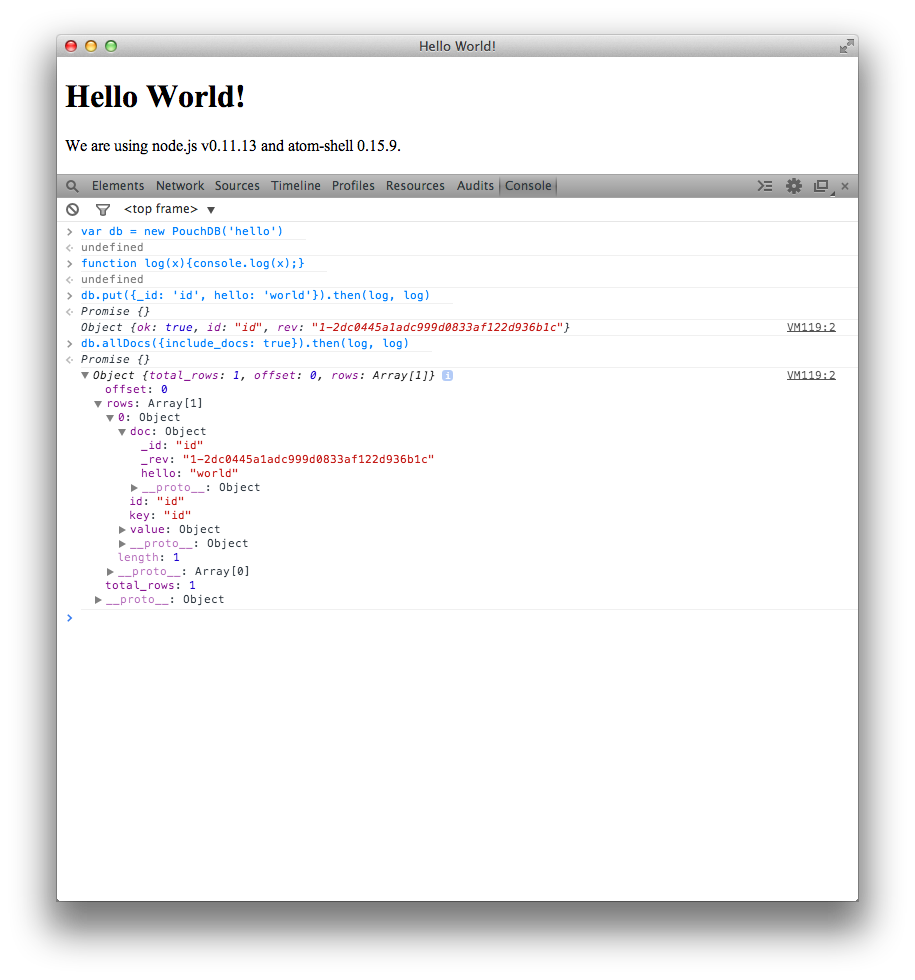

# atom-shell example app with PouchDB

This is a fork of the original [Atom Shell Hello World app](https://github.com/dougnukem/hello-atom) designed to show you how to integrate Atom Shell with PouchDB.

It uses npm to install PouchDB, but then relies on the browser version of PouchDB so that the app can use IndexedDB under the hood.



## atom-shell example app

This is an example atom-shell app based off these instructions:
- https://github.com/atom/atom-shell/blob/master/docs/tutorial/quick-start.md

To run you should be able to do the following:

`./run.sh`

OR manually:

Install grunt if you haven't already

```
npm install -g grunt-cli
```

Then run the following to download version 0.12.2 of atom-shell
```
cd ./build
npm install
grunt download-atom-shell
```

Then you should be able to run the app:

```
./build/atom-shell/Atom.app/Contents/MacOS/Atom ./hello-app
```

